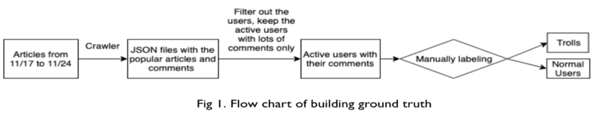

### Trolls-Terminator

Online trolls had become a large issue recently. Many discuss forum had been deeply affected by organized trolls or cyber army. In this project, we try to find out such trolls on PTT, which is the largest online discuss forum in Taiwan. We attempt to achieve our goal by combining three methods: IP behavior based threshold filter, comment statistics based threshold filter and content based support vector machine(SVM) classifier.

To build the ground truth, we manually classified the users that made more than fifty comments during a specific time period near the mayoral election. The total number of active user IDs in our dataset is about 3000. Based on the standard we set for trolls, we can reach overall 0.7 F1-score, 0.75 recall, 0.66 precision and 0.79 accuracy.

### Data Collection
In the following graph, we showed how we collect our ground truth dataset. Although PTT is an open-source forum, it does not have the troll labels that we need. Therefore, we manually labelled 2747 users. Since we assume the trolls will be more active when election approaches,  we first crawled all the articles and comments in the period of one week before the mayoral election in 2018. From this data, we selected the popular articles with a lot of comments, and manually classify whether these articles are political-related. On the other hand, we manually labeled the users who made a lot of comments as trolls or not as our ground truth. Users who with obvious political tendency while attacking others or urging others to vote for somebody would be classified as trolls. As a result, 835 (about one-third) of users are classified as trolls while the others are normal users. Among the 3020 popular articles, 2200(about two-third) of them are political articles.

### PTT Trolls Terminator
After some observation to the result of the three method we use to predict the class of the users, we find that comment length and IP process both has very good precision and accuracy yet very low recall. This means that users predicted as trolls by them are very likely to be trolls but we can only find few of these trolls. So we decide that for each id and its comment, we first filter it by IP behavior and comment length. If these methods predict the user as a troll, then we predict it as a troll. Otherwise, if they predict the id as an normal user, we then use SVM model to do the final decision. The following flow chart shows the flowchart for building PTT trolls terminator.

### Datasets
https://drive.google.com/drive/u/1/folders/0AH9reGUEmVJkUk9PVA
